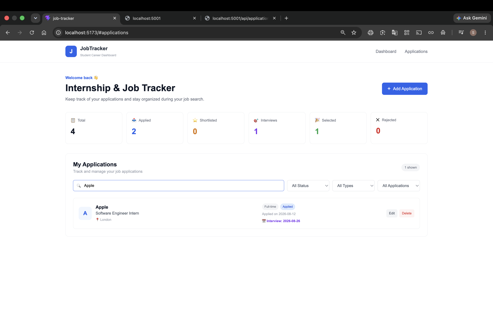
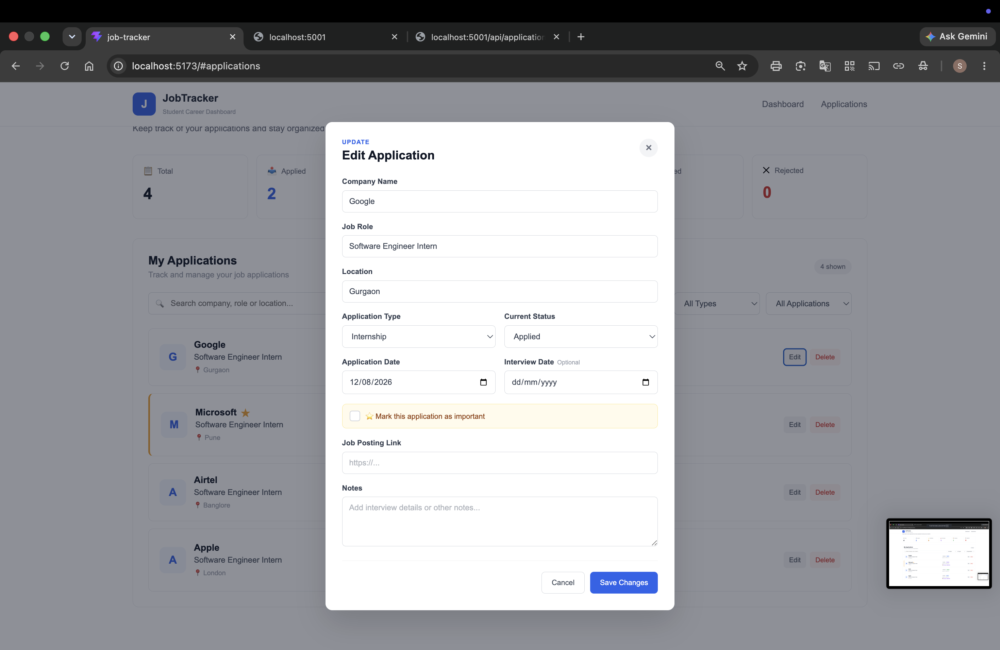
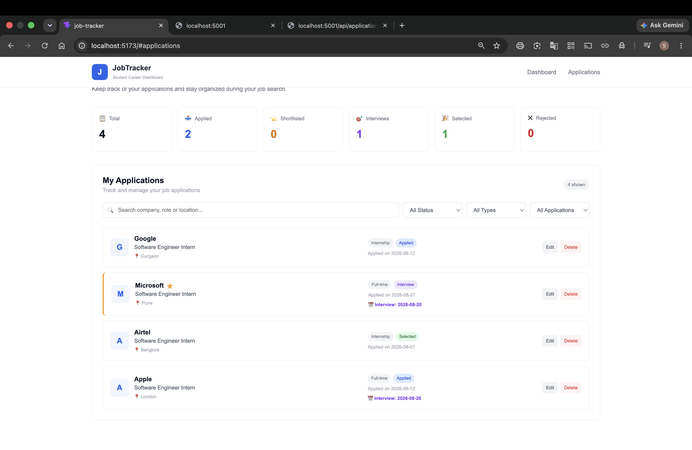

# JobTracker

A full-stack web application designed to help students manage and track their internship and job applications in one place.

## 📌 Project Overview

JobTracker provides a simple dashboard where users can maintain their job and internship applications. Users can add new applications, update their status, mark important applications, record interview dates, add notes, and delete applications.

The project was developed using React for the frontend and Node.js with Express.js for the backend.

## ✨ Features

- Add new job and internship applications
- Edit existing applications
- Delete applications
- Track application status
- Differentiate between Internship and Full-time applications
- Mark important applications ⭐
- Add interview dates 📅
- Add job posting links
- Add personal notes
- Search applications
- Filter applications by type and status
- Dashboard with application statistics
- Loading and error handling
- Data persistence using a JSON file
- REST API for frontend-backend communication

## 🛠️ Technologies Used

### Frontend

- HTML
- CSS
- JavaScript
- React
- Vite

### Backend

- Node.js
- Express.js
- REST API

### Data Storage

- JSON

### Development Tools

- Visual Studio Code
- Git
- GitHub

## 🏗️ System Architecture

The application follows a simple client-server architecture.

```text
                    JOBTRACKER
                        |
            +-----------+-----------+
            |                       |
       React Frontend          Node.js Backend
            |                       |
       React Components         Express Server
            |                       |
          App.jsx             REST API Routes
            |                       |
            +-----------+-----------+
                        |
                applications.json
                    Data Storage

The React frontend communicates with the Node.js/Express backend through REST API endpoints. The backend manages application data stored in a JSON file.

## 📂 Project Structure
job-tracker/
│
├── public/
│
├── src/
│   ├── components/
│   │   ├── ApplicationCard.jsx
│   │   ├── ApplicationForm.jsx
│   │   ├── Dashboard.jsx
│   │   ├── Navbar.jsx
│   │   └── Stats.jsx
│   │
│   ├── assets/
│   ├── App.jsx
│   ├── App.css
│   ├── index.css
│   └── main.jsx
│
├── server/
│   ├── data/
│   │   └── applications.json
│   │
│   ├── routes/
│   │   └── applicationRoutes.js
│   │
│   ├── server.js
│   ├── package.json
│   └── package-lock.json
│
├── index.html
├── package.json
├── package-lock.json
├── vite.config.js
└── README.md


## 🔗 API Endpoints

| Method | Endpoint                | Description            |
| ------ | ----------------------- | ---------------------- |
| GET    | `/api/applications`     | Fetch all applications |
| POST   | `/api/applications`     | Add a new application  |
| PUT    | `/api/applications/:id` | Update an application  |
| DELETE | `/api/applications/:id` | Delete an application  |


## 🚀 How to Run the Project
Prerequisites

Make sure the following are installed:
Node.js
npm
Git

1. Clone the repository:
    git clone https://github.com/Shruti-0105/job-tracker.git
2. Open the project:
    cd job-tracker
3. Install frontend dependencies
    npm install
4. Start the backend
Open a terminal and run:
    cd server
    npm install
    npm run dev
The backend will run on:
    http://localhost:5001
5. Start the frontend
Open another terminal from the main job-tracker folder and run:
    npm run dev
The frontend will run on:
    http://localhost:5173
Open the frontend URL in your browser.

## 🔄 Application Workflow
 User
  ↓
React Frontend
  ↓
Fetch API
  ↓
Node.js + Express
  ↓
REST API
  ↓
applications.json
  ↓
Response
  ↓
React Dashboard
```
## 📸 Screenshots

### Dashboard



### Application Form



### Application Card



##🎯 Learning Outcomes

Through this project, the following concepts were implemented:

React component-based development
React state management
Form handling
API integration using Fetch API
REST API development
CRUD operations
Node.js and Express.js
JSON-based data persistence
Frontend-backend integration
Git and GitHub version control

##🔮 Future Enhancements

Possible future improvements include:

User authentication
Database integration
Email notifications for interviews
Online deployment
Advanced analytics
Calendar integration


##👩‍💻 Author

Shruti
GitHub: https://github.com/Shruti-0105
